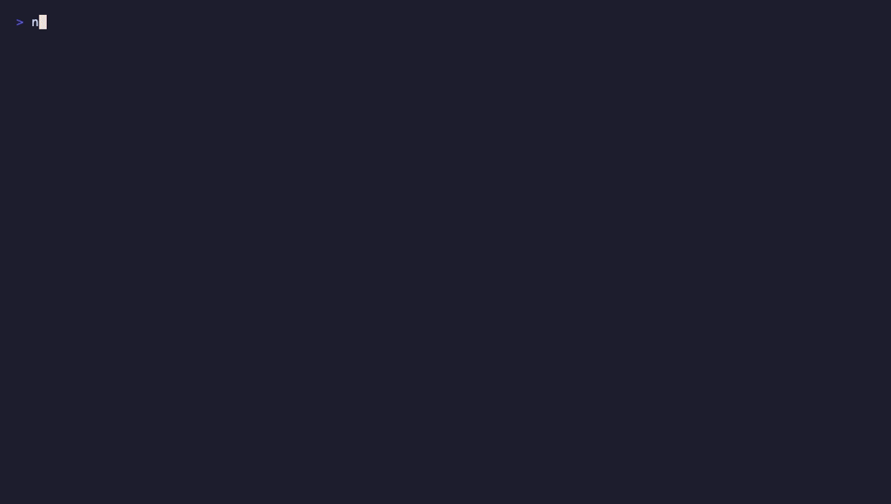

# nodrain

> A terminal ERC-20 token-approval scanner. Find a wallet's active approvals,
> flag unlimited allowances and known-risky spenders, and export revoke.cash
> links plus **unsigned** `approve(spender, 0)` calldata — all from your shell.

[](https://github.com/tienkane/nodrain/actions/workflows/ci.yml)
[](https://goreportcard.com/report/github.com/tienkane/nodrain)
[](LICENSE)



Every token approval you grant is standing permission for a contract to move your
tokens. Forgotten unlimited approvals are one of the most common ways wallets get
drained. `nodrain` shows you exactly what is still exposed — and never touches
your keys.

## Why it's safe by design

`nodrain` is **read-only**. It never asks for, stores, or uses a private key, and
it never signs or broadcasts a transaction. The only "write" it produces is an
*unsigned* `approve(spender, 0)` payload that you submit yourself — from your own
wallet, or by opening the generated revoke.cash link. There is simply no signing
code in the binary.

## Features

- 🔭 **Full history, live truth** — discovers every `Approval` event for a wallet
  via the Etherscan V2 API, then re-reads the *current* allowance on-chain so it
  only ever shows what is still active.
- ⚡ **One round-trip** — batches hundreds of `allowance` / `symbol` / `decimals`
  reads into a handful of calls through [Multicall3](https://www.multicall3.com).
- 🚩 **Risk-aware** — flags unlimited allowances (using revoke.cash's
  `allowance > totalSupply` rule, not just `2^256-1`) and spenders on the
  MIT-licensed [approval-exploit-list](https://github.com/RevokeCash/approval-exploit-list).
- 🏷️ **Human labels** — names common spenders offline, and enriches the rest from
  the public [whois.revoke.cash](https://whois.revoke.cash) dataset.
- 🔐 **Permit2 aware** — surfaces Permit2 approvals and warns that revoking them
  does not clear already-signed downstream permits.
- 🖥️ **Polished TUI** — a Bubble Tea multi-select table; or `--json` for scripts.
- 📦 **Single static binary** — no runtime, no dependencies.

## Install

```sh
# Homebrew. The cask strips the macOS quarantine flag, so Homebrew asks you to
# trust the tap once.
brew tap tienkane/tap
brew trust tienkane/tap
brew install --cask nodrain

# Go
go install github.com/tienkane/nodrain@latest

# Or download a prebuilt binary from the Releases page:
# https://github.com/tienkane/nodrain/releases
```

## Quick start

```sh
# A free Etherscan V2 key works across every supported chain.
export ETHERSCAN_API_KEY=YOUR_KEY   # https://etherscan.io/myapikey

# Interactive scan (↑/↓ move, space selects, enter reviews & exports):
nodrain scan 0xd8dA6BF26964aF9D7eEd9e03E53415D37aA96045

# Pick a chain:
nodrain scan --chain arbitrum 0xYourWallet

# Scriptable output:
nodrain scan --json 0xYourWallet | jq '.[] | select(.unlimited)'

# Write an unsigned revoke bundle for every unlimited approval:
nodrain export --unlimited --out bundle.json 0xYourWallet
```

## Usage

```
nodrain scan   [wallet]   Scan a wallet for active token approvals (opens the TUI)
nodrain export [wallet]   Write revoke.cash links + unsigned calldata
nodrain version           Print version information
```

### Flags

| Flag              | Env                 | Default    | Description                                        |
| ----------------- | ------------------- | ---------- | -------------------------------------------------- |
| `--chain`         |                     | `ethereum` | Chain to scan (see below)                          |
| `--address`       |                     | —          | Wallet address (or pass it as the first argument)  |
| `--etherscan-key` | `ETHERSCAN_API_KEY` | —          | Etherscan V2 API key                               |
| `--rpc`           | `NODRAIN_RPC_URL`    | public RPC | RPC endpoint for on-chain reads                    |
| `--proxy`         |                     | `false`    | Read on-chain state via the Etherscan proxy        |
| `--json`          |                     | `false`    | Print approvals as JSON (`scan` only)              |
| `--out, -o`       |                     | stdout     | Write the bundle to a file (`export` only)         |
| `--unlimited`     |                     | `false`    | Export only unlimited approvals (`export` only)    |
| `--no-labels`     |                     | `false`    | Skip remote spender-label lookups                  |
| `--no-risk`       |                     | `false`    | Skip the approval-exploit-list check               |

### Supported chains

| Name       | Chain ID | Etherscan free tier |
| ---------- | -------- | ------------------- |
| `ethereum` | 1        | ✅                  |
| `arbitrum` | 42161    | ✅                  |
| `polygon`  | 137      | ✅                  |
| `base`     | 8453     | requires paid key   |
| `optimism` | 10       | requires paid key   |
| `bsc`      | 56       | requires paid key   |

> As of November 2025 Etherscan's free tier no longer serves logs for Base,
> Optimism, and BNB Smart Chain. `nodrain` detects this and tells you a paid key
> is needed rather than failing cryptically.

## How it works

```
wallet ─▶ Etherscan getLogs (Approval events, all tokens)
       ─▶ dedup to the latest grant per (token, spender)
       ─▶ Multicall3: live allowance + symbol + decimals + totalSupply
       ─▶ drop anything that reads back 0 (spent or already revoked)
       ─▶ classify (unlimited / exploit / Permit2) + label spenders
       ─▶ TUI table  ·  --json  ·  export bundle
```

On-chain reads go through a public RPC by default (Multicall3); pass `--rpc` to
use your own node, or `--proxy` to route reads through Etherscan with no RPC at
all.

## Building from source

```sh
git clone https://github.com/tienkane/nodrain
cd nodrain
go build .            # produces ./nodrain
go test ./...         # unit tests
NODRAIN_INTEGRATION=1 go test ./internal/evm   # live mainnet sanity check
```

Requires Go 1.25+.

## License

[MIT](LICENSE). Bundled spender labels and the exploit list derive from the
MIT-licensed RevokeCash datasets. The GPL-3.0 ScamSniffer database is never
bundled.
